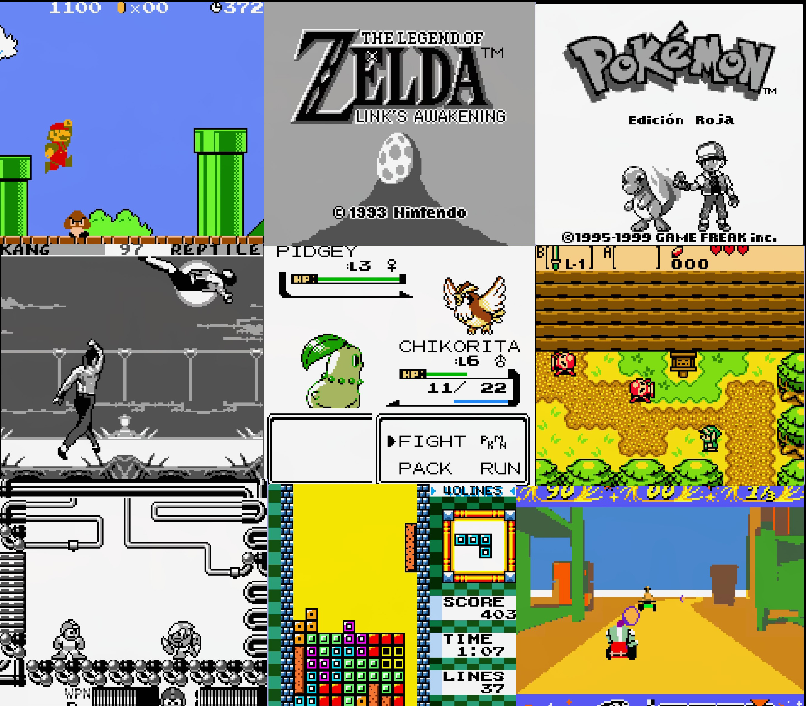

# gb-emulator
A Gameboy & Gameboy Color emulator for Linux and Android!



## Prerequisites
- Build-Essential `sudo apt install build-essential`
- SDL3 library `sudo apt install libsdl3-dev`
- SDL3-ttf library `sudo apt install libsdl3-ttf-dev`
- SDL3-image library `sudo apt install libsdl3-image-dev`
- Cmake `sudo apt install cmake`

## Command Line Build

``` sh
mkdir build
cd build
cmake ..
make
./platform/desktop/gbemu path/to/rom
```

## Android Build

Open android-project folder with Android-Studio and press build.

## Controls (Desktop)

| Button | Key |
| --- | --- |
| A | <kbd>J</kbd> |
| B | <kbd>K</kbd> |
| Start |<kbd>Space</kbd>
| Select | <kbd>Enter</kbd> |
| Up | <kbd>W</kbd> |
| Down | <kbd>S</kbd> |
| Left | <kbd>A</kbd> |
| Right | <kbd>D</kbd> |

